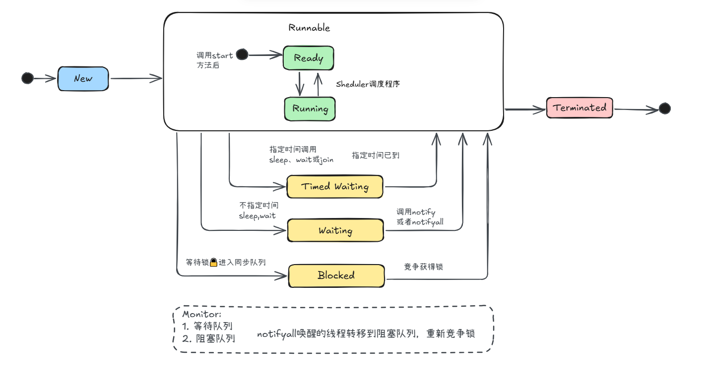

# 线程的两种创建方式

## 方式一：实现 Runnable 接口

```java
public class DoSomething implements Runnable {

    public void run() {
        System.out.println(Thread.currentThread().getName() + " I'm doing something!");
    }
}
```

**调用方式**：
```java
new Thread(new DoSomething()).start();
```

---

## 方式二：继承 Thread 类

```java
public class DoSomethingToo extends Thread {

    @Override
    public void run() {
        System.out.println(Thread.currentThread().getName() + " I'm doing something too!");
    }
}
```

**调用方式**：
```java
new DoSomethingToo().start();
```

---

# 两种方式对比

| 方式 | 优点 | 缺点 |
|------|------|------|
| `implements Runnable` | 更灵活，可继承其他类 | 需要包装成 Thread |
| `extends Thread` | 使用 `getName()` 更方便 | 无法继承其他类 |

---

# 启动线程

- **`start()`**: 启动线程（异步执行 `run()` 方法）
- **`run()`**: 直接调用则同步执行，不会创建新线程

---

# Thread 常用方法

- `Thread.currentThread().getName()` - 获取当前线程名称
- `getName()` - 获取线程名称（继承 Thread 时可用）

---

# 示例代码

- [DoSomething.java](https://github.com/upangka/ComicJava/blob/main/src/cn/comicjava/ch02/DoSomething.java) - Runnable 实现
- [DoSomethingToo.java](https://github.com/upangka/ComicJava/blob/main/src/cn/comicjava/ch02/DoSomethingToo.java) - Thread 继承
- [Main.java](https://github.com/upangka/ComicJava/blob/main/src/cn/comicjava/ch02/Main.java) - 启动线程

---

# 线程状态

Monitor:
1. 等待队列
2. 阻塞队列

> 为什么需要两个队列？

避免“惊群”和无效唤醒：

1. 等待队列中的线程即便获得锁，条件可能还不满足，所以需要条件判断循环；
2. 阻塞队列只关心锁本身，**不关心业务条件**。



---


# 接口与抽象类的结合

## 定义接口

```java
public interface NumberPrinter {
    void printNumber(int number);
}
```

---

## 抽象类实现接口 + Runnable

```java
public abstract class AbstractNumberPrinter implements NumberPrinter, Runnable {

    private int limit;

    public AbstractNumberPrinter(int limit) {
        this.limit = limit;
    }

    @Override
    public void run() {
        synchronized (AbstractNumberPrinter.class) {
            for (int i = 0; i < limit; i++) {
                if (acceptNumber(i)) {
                    printNumber(i);
                }
            }
        }
    }

    protected abstract boolean acceptNumber(int number);

    @Override
    public void printNumber(int number) {
        System.out.println(Thread.currentThread().getName() + " " + number);
    }
}
```

---

## 具体实现类

```java
public class EvenNumberPrinter extends AbstractNumberPrinter {

    public EvenNumberPrinter(int limit) {
        super(limit);
    }

    @Override
    protected boolean acceptNumber(int number) {
        return number % 2 == 0;
    }
}
```

```java
public class OddNumberPrinter extends AbstractNumberPrinter {

    public OddNumberPrinter(int limit) {
        super(limit);
    }

    @Override
    protected boolean acceptNumber(int number) {
        return number % 2 != 0;
    }
}
```

---

## 启动线程

```java
int limit = 100;
new Thread(new EvenNumberPrinter(limit), "偶数线程").start();
new Thread(new OddNumberPrinter(limit), "奇数线程").start();
```

---

## synchronized 同步

- `synchronized` 保证同一时刻只有一个线程执行同步代码块
- `synchronized (xxx.class)` - 锁定类的所有实例

---

## 模板方法模式

- `AbstractNumberPrinter` 定义 `run()` 模板骨架
- 子类只需实现 `acceptNumber()` 决定哪些数字需要打印
- 父类控制流程，子类负责细节实现

---

## 示例代码

- [NumberPrinter.java](https://github.com/upangka/ComicJava/blob/main/src/cn/comicjava/ch02/numbergames/NumberPrinter.java) - 接口
- [AbstractNumberPrinter.java](https://github.com/upangka/ComicJava/blob/main/src/cn/comicjava/ch02/numbergames/AbstractNumberPrinter.java) - 抽象类
- [EvenNumberPrinter.java](https://github.com/upangka/ComicJava/blob/main/src/cn/comicjava/ch02/numbergames/EvenNumberPrinter.java) - 偶数打印
- [OddNumberPrinter.java](https://github.com/upangka/ComicJava/blob/main/src/cn/comicjava/ch02/numbergames/OddNumberPrinter.java) - 奇数打印
- [Main.java](https://github.com/upangka/ComicJava/blob/main/src/cn/comicjava/ch02/numbergames/Main.java) - 启动线程


---

# Thread.join() 等待线程结束

## 场景描述

暗夜精灵需要等小矮人起床后才能出发进入战斗。

**原始输出（无 join）**：
```
暗夜精灵: "起——来——！！！！"
暗夜精灵: "出发吧！进入战斗！"
【小矮人 (有点晚)】: "哈——欠，唉，早上好，我来了，我来了。"
```

**期望输出（有 join）**：
```
暗夜精灵: "起——来——！！！！"
【小矮人 (有点晚)】: "哈——欠，唉，早上好，我来了，我来了。"
暗夜精灵: "出发吧！进入战斗！"
```

---

## 实现方式

```java
public class Main {
    public static void main(String[] args) {
        final Dwarf dwarf = new Dwarf("小矮人");
        final NightElf nightElf = new NightElf("暗夜精灵");

        final Thread dwarfThread = new Thread(() -> {
            dwarf.chargeIntoBattle(nightElf);
        });

        final Thread elfThread = new Thread(() -> {
            try {
                dwarfThread.join();  // 等待 dwarfThread 执行完毕
            } catch (InterruptedException e) {
                e.printStackTrace();
            }
            nightElf.chargeIntoBattle(dwarf);
        });

        dwarfThread.start();
        elfThread.start();
    }
}
```

---

## Hero 抽象类

```java
public abstract class Hero {
    private String name;

    public Hero(String name) {
        this.name = name;
    }

    public String getName() {
        return name;
    }

    public abstract void chargeIntoBattle(Hero hero);
}
```

---

## Dwarf 实现（小矮人赖床）

```java
public class Dwarf extends Hero {
    public Dwarf(String name) {
        super(name);
    }

    @Override
    public void chargeIntoBattle(Hero hero) {
        System.out.printf("%s: \"起——来——！！！！\"%n", hero.getName());
        try {
            Thread.sleep(5000);  // 模拟赖床 5 秒
        } catch (InterruptedException e) {
            e.printStackTrace();
        }
        System.out.printf("【%s (有点晚)】: \"哈——欠，唉，早上好，我来了，我来了。\"%n", this.getName());
    }
}
```

---

## NightElf 实现（暗夜精灵）

```java
public class NightElf extends Hero {
    public NightElf(String name) {
        super(name);
    }

    @Override
    public void chargeIntoBattle(Hero hero) {
        System.out.printf("%s: \"出发吧！进入战斗！\"%n", this.getName());
    }
}
```

---

## join() 核心要点

- `thread.join()` - 等待指定线程执行完毕
- `thread.join(millis)` - 等待指定线程，最多等待指定毫秒
- 需要捕获 `InterruptedException`
- 常用于线程间**依赖关系**：B 线程需要等 A 线程完成后再执行

---

## 示例代码

- [Hero.java](https://github.com/upangka/ComicJava/blob/main/src/cn/comicjava/ch02/wow/join/Hero.java) - 抽象类
- [Dwarf.java](https://github.com/upangka/ComicJava/blob/main/src/cn/comicjava/ch02/wow/join/Dwarf.java) - 小矮人（赖床）
- [NightElf.java](https://github.com/upangka/ComicJava/blob/main/src/cn/comicjava/ch02/wow/join/NightElf.java) - 暗夜精灵
- [Main.java](https://github.com/upangka/ComicJava/blob/main/src/cn/comicjava/ch02/wow/join/Main.java) - 使用 join 等待线程

---

*（待续...）*

