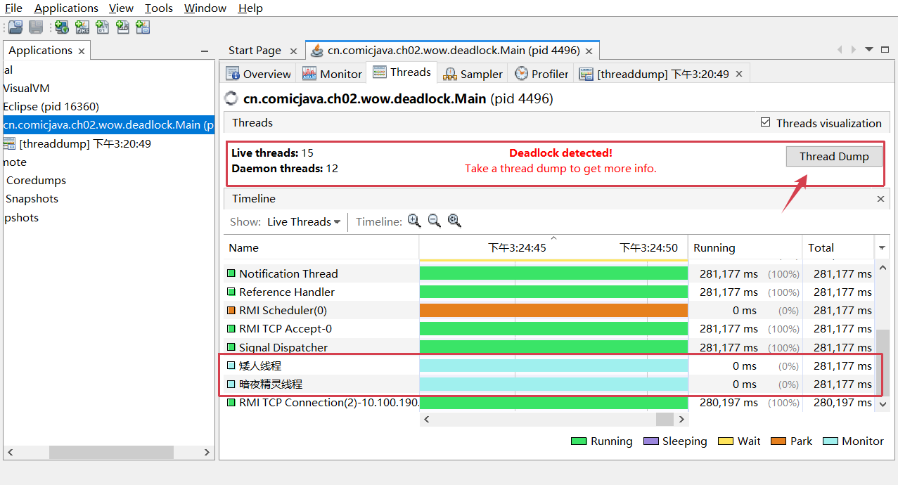

# 线程的两种创建方式

## 方式一：实现 Runnable 接口

```java
public class DoSomething implements Runnable {

    public void run() {
        System.out.println(Thread.currentThread().getName() + " I'm doing something!");
    }
}
```

**调用方式**：
```java
new Thread(new DoSomething()).start();
```

---

## 方式二：继承 Thread 类

```java
public class DoSomethingToo extends Thread {

    @Override
    public void run() {
        System.out.println(Thread.currentThread().getName() + " I'm doing something too!");
    }
}
```

**调用方式**：
```java
new DoSomethingToo().start();
```

---

# 两种方式对比

| 方式 | 优点 | 缺点 |
|------|------|------|
| `implements Runnable` | 更灵活，可继承其他类 | 需要包装成 Thread |
| `extends Thread` | 使用 `getName()` 更方便 | 无法继承其他类 |

---

# 启动线程

- **`start()`**: 启动线程（异步执行 `run()` 方法）
- **`run()`**: 直接调用则同步执行，不会创建新线程

---

# Thread 常用方法

- `Thread.currentThread().getName()` - 获取当前线程名称
- `getName()` - 获取线程名称（继承 Thread 时可用）

---

# 示例代码

- [DoSomething.java](https://github.com/upangka/ComicJava/blob/main/src/cn/comicjava/ch02/DoSomething.java) - Runnable 实现
- [DoSomethingToo.java](https://github.com/upangka/ComicJava/blob/main/src/cn/comicjava/ch02/DoSomethingToo.java) - Thread 继承
- [Main.java](https://github.com/upangka/ComicJava/blob/main/src/cn/comicjava/ch02/Main.java) - 启动线程

---

# 线程状态

Monitor Lock（监视器锁）:
1. 等待队列
2. 阻塞队列

> 为什么需要两个队列？

避免“惊群”和无效唤醒：

1. 等待队列中的线程即便获得锁，条件可能还不满足，所以需要条件判断循环；
2. 阻塞队列只关心锁本身，**不关心业务条件**。


---


# 接口与抽象类的结合

## 定义接口

```java
public interface NumberPrinter {
    void printNumber(int number);
}
```

---

## 抽象类实现接口 + Runnable

```java
public abstract class AbstractNumberPrinter implements NumberPrinter, Runnable {

    private int limit;

    public AbstractNumberPrinter(int limit) {
        this.limit = limit;
    }

    @Override
    public void run() {
        synchronized (AbstractNumberPrinter.class) {
            for (int i = 0; i < limit; i++) {
                if (acceptNumber(i)) {
                    printNumber(i);
                }
            }
        }
    }

    protected abstract boolean acceptNumber(int number);

    @Override
    public void printNumber(int number) {
        System.out.println(Thread.currentThread().getName() + " " + number);
    }
}
```

---

## 具体实现类

```java
public class EvenNumberPrinter extends AbstractNumberPrinter {

    public EvenNumberPrinter(int limit) {
        super(limit);
    }

    @Override
    protected boolean acceptNumber(int number) {
        return number % 2 == 0;
    }
}
```

```java
public class OddNumberPrinter extends AbstractNumberPrinter {

    public OddNumberPrinter(int limit) {
        super(limit);
    }

    @Override
    protected boolean acceptNumber(int number) {
        return number % 2 != 0;
    }
}
```

---

## 启动线程

```java
int limit = 100;
new Thread(new EvenNumberPrinter(limit), "偶数线程").start();
new Thread(new OddNumberPrinter(limit), "奇数线程").start();
```

---

## synchronized 同步

- `synchronized` 保证同一时刻只有一个线程执行同步代码块
- `synchronized (xxx.class)` - 锁定类的所有实例

---

## 模板方法模式

- `AbstractNumberPrinter` 定义 `run()` 模板骨架
- 子类只需实现 `acceptNumber()` 决定哪些数字需要打印
- 父类控制流程，子类负责细节实现

---

## 示例代码

- [NumberPrinter.java](https://github.com/upangka/ComicJava/blob/main/src/cn/comicjava/ch02/numbergames/NumberPrinter.java) - 接口
- [AbstractNumberPrinter.java](https://github.com/upangka/ComicJava/blob/main/src/cn/comicjava/ch02/numbergames/AbstractNumberPrinter.java) - 抽象类
- [EvenNumberPrinter.java](https://github.com/upangka/ComicJava/blob/main/src/cn/comicjava/ch02/numbergames/EvenNumberPrinter.java) - 偶数打印
- [OddNumberPrinter.java](https://github.com/upangka/ComicJava/blob/main/src/cn/comicjava/ch02/numbergames/OddNumberPrinter.java) - 奇数打印
- [Main.java](https://github.com/upangka/ComicJava/blob/main/src/cn/comicjava/ch02/numbergames/Main.java) - 启动线程


---

# Thread.join() 等待线程结束

## 场景描述

暗夜精灵需要等小矮人起床后才能出发进入战斗。

**原始输出（无 join）**：
```
暗夜精灵: "起——来——！！！！"
暗夜精灵: "出发吧！进入战斗！"
【小矮人 (有点晚)】: "哈——欠，唉，早上好，我来了，我来了。"
```

**期望输出（有 join）**：
```
暗夜精灵: "起——来——！！！！"
【小矮人 (有点晚)】: "哈——欠，唉，早上好，我来了，我来了。"
暗夜精灵: "出发吧！进入战斗！"
```

---

## 实现方式

```java
public class Main {
    public static void main(String[] args) {
        final Dwarf dwarf = new Dwarf("小矮人");
        final NightElf nightElf = new NightElf("暗夜精灵");

        final Thread dwarfThread = new Thread(() -> {
            dwarf.chargeIntoBattle(nightElf);
        });

        final Thread elfThread = new Thread(() -> {
            try {
                dwarfThread.join();  // 等待 dwarfThread 执行完毕
            } catch (InterruptedException e) {
                e.printStackTrace();
            }
            nightElf.chargeIntoBattle(dwarf);
        });

        dwarfThread.start();
        elfThread.start();
    }
}
```

---

## Hero 抽象类

```java
public abstract class Hero {
    private String name;

    public Hero(String name) {
        this.name = name;
    }

    public String getName() {
        return name;
    }

    public abstract void chargeIntoBattle(Hero hero);
}
```

---

## Dwarf 实现（小矮人赖床）

```java
public class Dwarf extends Hero {
    public Dwarf(String name) {
        super(name);
    }

    @Override
    public void chargeIntoBattle(Hero hero) {
        System.out.printf("%s: \"起——来——！！！！\"%n", hero.getName());
        try {
            Thread.sleep(5000);  // 模拟赖床 5 秒
        } catch (InterruptedException e) {
            e.printStackTrace();
        }
        System.out.printf("【%s (有点晚)】: \"哈——欠，唉，早上好，我来了，我来了。\"%n", this.getName());
    }
}
```

---

## NightElf 实现（暗夜精灵）

```java
public class NightElf extends Hero {
    public NightElf(String name) {
        super(name);
    }

    @Override
    public void chargeIntoBattle(Hero hero) {
        System.out.printf("%s: \"出发吧！进入战斗！\"%n", this.getName());
    }
}
```

---

## join() 核心要点

- `thread.join()` - 等待指定线程执行完毕
- `thread.join(millis)` - 等待指定线程，最多等待指定毫秒
- 需要捕获 `InterruptedException`
- 常用于线程间**依赖关系**：B 线程需要等 A 线程完成后再执行

---

## 示例代码

- [Hero.java](https://github.com/upangka/ComicJava/blob/main/src/cn/comicjava/ch02/wow/join/Hero.java) - 抽象类
- [Dwarf.java](https://github.com/upangka/ComicJava/blob/main/src/cn/comicjava/ch02/wow/join/Dwarf.java) - 小矮人（赖床）
- [NightElf.java](https://github.com/upangka/ComicJava/blob/main/src/cn/comicjava/ch02/wow/join/NightElf.java) - 暗夜精灵
- [Main.java](https://github.com/upangka/ComicJava/blob/main/src/cn/comicjava/ch02/wow/join/Main.java) - 使用 join 等待线程

---

*（待续...）*

---

# 死锁（Deadlock）

## 场景描述

矮人和暗夜精灵约定在对方那里见面，然后一起出发。但由于他们都"先占先得"对方的家，导致谁也等不到谁。


**实际输出（死锁）**：
```
矮人: "我们在暗夜精灵那儿见面，那我就先出发了。"
暗夜精灵: "我们在矮人那儿见面，那我就先出发了。"
（程序卡住，不再输出）

```

---

## 代码实现

### Hero 类（关键）

```java
public class Hero {
    private String name;

    public synchronized void visit(Hero hero) {
        try {
            Thread.sleep(50);  // 让另一个线程有机会获取锁
        } catch (InterruptedException e) { }
        
        System.out.printf("%s: \"我们在%s那儿见面，那我就先出发了。\"%n", 
            this.getName(), hero.getName());
        hero.receiveVisit(this);  // 尝试调用对方的 synchronized 方法
    }

    public synchronized void receiveVisit(Hero hero) {
        System.out.printf("%s: \"我们在%s家见面了。\"%n", this.getName(), this.getName());
    }
}
```

### Main 启动两个线程

```java
new Thread(() -> dwarf.visit(nightElf)).start();       // 线程1
new Thread(() -> nightElf.visit(dwarf)).start();       // 线程2
```

---

## 死锁原因分析

[visualvm](https://visualvm.github.io/index.html)查看死锁



```
Found one Java-level deadlock:
=============================
"矮人线程":
  waiting to lock monitor 0x00000185c1fc9a70 (object 0x00000005aa97f810, a cn.comicjava.ch02.wow.deadlock.NightElf),
  which is held by "暗夜精灵线程"

"暗夜精灵线程":
  waiting to lock monitor 0x00000185c1fc9b50 (object 0x00000005aa97f7d0, a cn.comicjava.ch02.wow.deadlock.Dwarf),
  which is held by "矮人线程"
```

### 图解死锁过程

```
┌─────────────────────────────────────────────────────────────────────────┐
│                           死锁形成过程                                   │
├─────────────────────────────────────────────────────────────────────────┤
│                                                                         │
│  线程1: dwarf.visit(nightElf)                                          │
│    ├─ 获取 dwarf 对象的锁 ✓                                             │
│    ├─ sleep(50) 让出 CPU                                                │
│    └─ 尝试调用 nightElf.receiveVisit() → 需要获取 nightElf 对象的锁 ✗    │
│                                                                         │
│  线程2: nightElf.visit(dwarf)                                           │
│    ├─ 获取 nightElf 对象的锁 ✓                                          │
│    ├─ sleep(50) 让出 CPU                                                │
│    └─ 尝试调用 dwarf.receiveVisit() → 需要获取 dwarf 对象的锁 ✗         │
│                                                                         │
├─────────────────────────────────────────────────────────────────────────┤
│                                                                         │
│  持有资源的线程想要获取对方持有的资源，形成循环等待                       │
│                                                                         │
│     ┌──────────────┐         持有 dwarf         ┌──────────────┐        │
│     │   线程1      │ ─────────────────────────▶│    dwarf     │        │
│     │  (矮人线程)   │                            │   (矮人)     │        │
│     └──────────────┘                            └──────┬───────┘        │
│            │                                            │               │
│            │ 持有 nightElf                               │ 持有 dwarf    │
│            │                                            │               │
│            │ 等待 dwarf                                 │ 等待 nightElf │
│            │                                            │               │
│     ┌──────┴───────┐                            ┌──────┴───────┐        │
│     │  nightElf    │◀─────────────────────────│   线程2      │        │
│     │   (暗夜精灵)  │         持有 nightElf    │ (暗夜精灵线程) │        │
│     └──────────────┘                            └──────────────┘        │
│                                                                         │
│                    💀 死锁！双方都在等待对方释放锁                        │
└─────────────────────────────────────────────────────────────────────────┘
```

### 死锁四个必要条件（Coffman 条件）

| 条件 | 描述 | 本例中是否满足 |
|------|------|--------------|
| 互斥条件 | 一个资源一次只能被一个线程持有 | ✓ `synchronized` 保证 |
| 占有并等待 | 线程持有资源的同时请求其他资源 | ✓ 持有自己的锁，等对方的锁 |
| 不可抢占 | 资源不能被强制释放 | ✓ synchronized 无法抢占 |
| 循环等待 | 存在循环链：T1 等待 T2，T2 等待 T1 | ✓ 线程1等线程2，线程2等线程1 |


---

## 解决方案：使用共享锁对象

### 核心思想

打破"占有并等待"条件：让两个线程使用**同一个锁对象**，这样就能保证串行执行。

### 正确输出

```
矮人: "我们在暗夜精灵那儿见面，那我就先出发了。"
暗夜精灵: "我们在我家见面了。"
暗夜精灵: "我们在矮人那儿见面，那我就先出发了。"
矮人: "我们在我家见面了。"
```

### Hero 类修改

```java
public class Hero {
    private String name;
    private Object lock;  // 新增：可设置的锁对象

    public Hero(String name) {
        this.name = name;
    }

    public Object getLock() {
        return lock;
    }

    public void setLock(Object lock) {
        this.lock = lock;
    }

    public void visit(Hero hero) {
        synchronized (this.getLock()) {  // 使用共享的 lock
            try {
                Thread.sleep(50);
            } catch (InterruptedException e) { }

            System.out.printf("%s: \"我们在%s那儿见面，那我就先出发了。\"%n",
                this.getName(), hero.getName());
            hero.receiveVisit(this);
        }
    }

    public void receiveVisit(Hero hero) {
        synchronized (this.getLock()) {  // 使用共享的 lock
            System.out.printf("%s: \"我们在我家见面了。\"%n", this.getName());
        }
    }
}
```

### Main 类修改（关键）

```java
public class Main {
    public static void main(String[] args) {
        final Dwarf dwarf = new Dwarf("矮人");
        final NightElf nightElf = new NightElf("暗夜精灵");

        // 创建共享锁对象
        Object lock = new Object();
        dwarf.setLock(lock);      // 两个英雄使用同一个锁
        nightElf.setLock(lock);

        new Thread(() -> dwarf.visit(nightElf), "矮人线程").start();
        new Thread(() -> nightElf.visit(dwarf), "暗夜精灵线程").start();
    }
}
```

### 图解解决方案

```
┌─────────────────────────────────────────────────────────────────────────┐
│                     解决方案：使用共享锁对象                             │
├─────────────────────────────────────────────────────────────────────────┤
│                                                                         │
│  Main 中创建共享锁: Object lock = new Object();                        │
│                                                                         │
│     ┌─────────────────────────────────────────────────────────────┐     │
│     │                    共享的 lock 对象                          │     │
│     │                        ┌───────┐                            │     │
│     │                        │  lock │                            │     │
│     │                        └───┬───┘                            │     │
│     │                   ┌────────┴────────┐                       │     │
│     │                   ▼                 ▼                       │     │
│     │             ┌──────────┐       ┌──────────┐                 │     │
│     │             │  dwarf   │       │ nightElf │                 │     │
│     │             │  (矮人)   │       │(暗夜精灵) │                 │     │
│     │             └──────────┘       └──────────┘                 │     │
│     └─────────────────────────────────────────────────────────────┘     │
│                                                                         │
│  线程1: dwarf.visit(nightElf)                                          │
│    └─ 获取 lock 锁 ✓ → 完成后再让出 CPU                                 │
│                                                                         │
│  线程2: nightElf.visit(dwarf)                                           │
│    └─ 等线程1释放 lock 后 → 获取 lock 锁 ✓ → 完成                      │
│                                                                         │
│                    ✅ 串行执行，不会死锁！                                │
└─────────────────────────────────────────────────────────────────────────┘
```

### 为什么不会死锁？

| 原因 | 说明 |
|------|------|
| 同一时刻只有一个线程持有锁 | `synchronized (sharedLock)` 保证 |
| 打破循环等待 | 不再是线程1持A等B，线程2持B等A |
| 有序执行 | 线程1执行完 → 释放锁 → 线程2获取锁执行 |

### 示例代码

- [Hero.java](https://github.com/upangka/ComicJava/blob/main/src/cn/comicjava/ch02/wow/lockobj/Hero.java) - 使用共享锁
- [Dwarf.java](https://github.com/upangka/ComicJava/blob/main/src/cn/comicjava/ch02/wow/lockobj/Dwarf.java)
- [NightElf.java](https://github.com/upangka/ComicJava/blob/main/src/cn/comicjava/ch02/wow/lockobj/NightElf.java)
- [Main.java](https://github.com/upangka/ComicJava/blob/main/src/cn/comicjava/ch02/wow/lockobj/Main.java) - 设置共享锁

---

## 解决方案二：使用 ReentrantLock + tryLock

### 核心思想

使用 `Lock.tryLock()` 尝试获取锁，而不是阻塞等待。如果获取失败，立即放弃，避免无限等待导致的死锁。

### 正确输出

```
(任务1)矮人: "我们在暗夜精灵那儿见面，那我就先出发了。"
(任务1)暗夜精灵: "我们在我家见面了。"
(任务2)暗夜精灵: "抱歉，我在忙，下次再约吧。"
```

### Hero 类实现

```java
import java.util.concurrent.locks.Lock;
import java.util.concurrent.locks.ReentrantLock;

public class Hero {
    private String name;
    private Lock lock = new ReentrantLock();

    public Hero(String name) {
        this.name = name;
    }

    public Lock getLock() {
        return lock;
    }

    // 尝试同时获取两个锁
    private boolean meetAt(Hero hero) {
        boolean iLocked = false;
        boolean heroLocked = false;
        try {
            iLocked = lock.tryLock();           // 非阻塞获取锁
            heroLocked = hero.getLock().tryLock(); // 非阻塞获取锁
        } finally {
            // 如果没有同时获取到两个锁，释放已获取的
            if (!(iLocked && heroLocked)) {
                if (iLocked) lock.unlock();
                if (heroLocked) hero.getLock().unlock();
            }
        }
        // 返回 true 时锁仍在持有状态，需要调用者释放
        return iLocked && heroLocked;
    }

    // 释放两个锁
    public void unlockBoth(Hero hero) {
        try {
            hero.getLock().unlock(); // 先释放 hero 的锁
        } finally {
            lock.unlock();          // 最后释放自己的锁
        }
    }

    public void visit(Hero hero) {
        if (meetAt(hero)) {
            try {
                System.out.printf("(%s)%s: \"我们在%s那儿见面，那我就先出发了。\"%n",
                    Thread.currentThread().getName(), this.getName(), hero.getName());
                hero.receiveVisit(this);
            } finally {
                unlockBoth(hero);  // 正确释放两个锁
            }
        } else {
            System.out.printf("(%s)%s: \"抱歉，我在忙，下次再约吧。\"%n",
                Thread.currentThread().getName(), this.getName());
        }
    }

    public void receiveVisit(Hero hero) {
        System.out.printf("(%s)%s: \"我们在我家见面了。\"%n",
            Thread.currentThread().getName(), this.getName());
    }
}
```

### 图解 tryLock 流程

```
┌─────────────────────────────────────────────────────────────────────────┐
│                     tryLock() 非阻塞获取锁                              │
├─────────────────────────────────────────────────────────────────────────┤
│                                                                         │
│  线程1: dwarf.visit(nightElf)                                          │
│    ├─ lock.tryLock() → ✓ 成功                                           │
│    ├─ hero.getLock().tryLock() → ✓ 成功                                 │
│    └─ 执行 visit 逻辑 → 完成                                             │
│                                                                         │
│  线程2: nightElf.visit(dwarf)                                          │
│    ├─ lock.tryLock() → ✗ 失败（被线程1持有）                            │
│    ├─ 立即放弃，释放已获取的锁                                           │
│    └─ 输出 "抱歉，我在忙，下次再约吧。"                                  │
│                                                                         │
│                    ✅ 不会出现死锁！                                      │
└─────────────────────────────────────────────────────────────────────────┘
```

### 可能出现的输出情况

| 场景 | 输出 | 说明 |
|------|------|------|
| **A** | 任务1: 我们在暗夜精灵那儿见面...<br>任务1: 我们在我家见面了。<br>任务2: 抱歉，我在忙... | 任务1先获取两个锁 |
| **B** | 任务2: 我们在矮人那儿见面...<br>任务2: 我们在我家见面了。<br>任务1: 抱歉，我在忙... | 任务2先获取两个锁 |
| **C** | 任务1: 抱歉，我在忙...<br>任务2: 抱歉，我在忙... | 都没有获取到两个锁 |

### 与 synchronized 对比

| 特性 | synchronized | ReentrantLock + tryLock |
|------|-------------|------------------------|
| 获取锁 | 阻塞等待 | 非阻塞尝试 |
| 死锁风险 | 高（等待无限期） | 低（获取失败立即放弃） |
| 灵活性 | 低 | 高（可设置超时、可中断） |
| 代码复杂度 | 低 | 较高（需手动释放锁） |

### 示例代码

- [Hero.java](https://github.com/upangka/ComicJava/blob/main/src/cn/comicjava/ch02/wow/lockjuc/Hero.java) - 使用 ReentrantLock + tryLock
- [Dwarf.java](https://github.com/upangka/ComicJava/blob/main/src/cn/comicjava/ch02/wow/lockjuc/Dwarf.java)
- [NightElf.java](https://github.com/upangka/ComicJava/blob/main/src/cn/comicjava/ch02/wow/lockjuc/NightElf.java)
- [Main.java](https://github.com/upangka/ComicJava/blob/main/src/cn/comicjava/ch02/wow/lockjuc/Main.java)

---

# 活锁（Livelock）

## 场景描述

矮人和暗夜精灵都口渴想喝啤酒，但只有一瓶啤酒。他们互相礼让，结果谁也喝不到，程序无限循环。

**输出**（无限重复）：
```
矮人: "你先喝吧，我的朋友！"
暗夜精灵: "你先喝吧，我的朋友！"
矮人: "你先喝吧，我的朋友！"
暗夜精灵: "你先喝吧，我的朋友！"
...
（程序永远不会停止）
```

---

## 代码实现

### Beer 类（共享资源）

```java
public class Beer {
    private Hero owner;

    public Beer(Hero hero) {
        this.owner = hero;
    }

    public synchronized Hero getOwner() {
        return owner;
    }

    public synchronized void setOwner(Hero hero) {
        this.owner = hero;
    }

    public synchronized void drink() {
        System.out.printf("%s 喝了啤酒%n", owner.getName());
    }
}
```

### Hero 类（核心逻辑）

```java
public class Hero {
    private String name;
    private boolean isThirsty = true;

    public void drink(Beer beer, Hero drinkingPartner) {
        while (this.isThirsty()) {  // 只要还口渴就一直循环
            if (beer.getOwner() != this) {
                continue;  // 啤酒不是我的，等待
            } else if (drinkingPartner.isThirsty()) {
                // 对方也口渴，我让给他
                System.out.printf("%s: \"你先喝吧，我的朋友！\"%n", name);
                beer.setOwner(drinkingPartner);
            } else {
                // 对方喝完了，我喝
                beer.drink();
                this.isThirsty = false;
                System.out.printf("%s: \"真好喝！\"%n", name);
                beer.setOwner(drinkingPartner);
            }
        }
    }
}
```

### Main 启动两个线程

```java
public class Main {
    public static void main(String[] args) {
        final Dwarf dwarf = new Dwarf("矮人");
        final NightElf nightElf = new NightElf("暗夜精灵");
        final Beer beer = new Beer(dwarf);

        new Thread(() -> dwarf.drink(beer, nightElf)).start();
        new Thread(() -> nightElf.drink(beer, dwarf)).start();
    }
}
```

---

## 死锁 vs 活锁

| 特性 | 死锁（Deadlock） | 活锁（Livelock） |
|------|-----------------|-----------------|
| 线程状态 | 阻塞等待，不做任何操作 | 持续运行，但无法前进 |
| CPU 消耗 | 正常 | 较高（忙等待） |
| 程序表现 | 完全卡住 | 无限循环执行 |
| 原因 | 循环等待 | 过度礼让/重复重试 |

---

## 图解活锁过程

```
┌─────────────────────────────────────────────────────────────────────────┐
│                           活锁形成过程                                   │
├─────────────────────────────────────────────────────────────────────────┤
│                                                                         │
│  初始状态: 啤酒属于矮人                                                 │
│                                                                         │
│     ┌──────────────────────────────────────────────────────────────┐    │
│     │                         啤酒                                 │    │
│     │                         🥛                                   │    │
│     │                      属于矮人                                 │    │
│     └──────────────────────────────────────────────────────────────┘    │
│                                                                         │
│  线程1: 矮人.drink(beer, 暗夜精灵)                                      │
│    ├─ beer.getOwner() == 矮人 → 拥有啤酒                              │
│    ├─ 暗夜精灵.isThirsty() == true → 对方也口渴                        │
│    ├─ 输出 "你先喝吧，我的朋友！"                                       │
│    └─ beer.setOwner(暗夜精灵) → 啤酒让给对方                           │
│                                                                         │
│  线程2: 暗夜精灵.drink(beer, 矮人)                                      │
│    ├─ beer.getOwner() == 暗夜精灵 → 拥有啤酒                           │
│    ├─ 矮人.isThirsty() == true → 对方也口渴                            │
│    ├─ 输出 "你先喝吧，我的朋友！"                                       │
│    └─ beer.setOwner(矮人) → 啤酒让回给对方                             │
│                                                                         │
│                    💫 循环往复，永远无法喝到啤酒！                        │
└─────────────────────────────────────────────────────────────────────────┘
```

---

## 活锁特点

- **线程没有阻塞**：一直在执行 `while` 循环
- **无法完成任务**：虽然在做动作（让啤酒），但永远达不到目标
- **资源未被占用**：CPU 在忙，但啤酒被反复转手
- **与死锁的区别**：死锁是完全不动，活锁是都在动但做无用功

---

## 活锁的另一种理解

想象两个礼貌的人在狭窄的走廊相遇：
- 死锁：两人都站在原地不动，互相让对方先过
- 活锁：两人都主动让路，但方向一致，左躲右闪还是撞不上

---

## 示例代码

- [Beer.java](https://github.com/upangka/ComicJava/blob/main/src/cn/comicjava/ch02/wow/livelock/Beer.java) - 共享资源
- [Hero.java](https://github.com/upangka/ComicJava/blob/main/src/cn/comicjava/ch02/wow/livelock/Hero.java) - 核心逻辑
- [Dwarf.java](https://github.com/upangka/ComicJava/blob/main/src/cn/comicjava/ch02/wow/livelock/Dwarf.java)
- [NightElf.java](https://github.com/upangka/ComicJava/blob/main/src/cn/comicjava/ch02/wow/livelock/NightElf.java)
- [Main.java](https://github.com/upangka/ComicJava/blob/main/src/cn/comicjava/ch02/wow/livelock/Main.java)

---

## 活锁解决方案：礼让次数限制

### 问题分析

原代码中 `drinkingPartner.isThirsty()` 始终为 `true`，永远无法进入 `else` 分支，`isThirsty` 永远无法设为 `false`。

### 解决思路

每个英雄最多礼让 N 次，超过后强制执行，不再让步。

### 正确输出

```
矮人: "你先喝吧，我的朋友！"
矮人: "你先喝吧，我的朋友！"
矮人: "你先喝吧，我的朋友！"
暗夜精灵: "你先喝吧，我的朋友！"
矮人: "你先喝吧，我的朋友！"
暗夜精灵: "你先喝吧，我的朋友！"
矮人: "你先喝吧，我的朋友！"
暗夜精灵: "你先喝吧，我的朋友！"
矮人: "不客气了，我先喝！"
矮人 喝了啤酒
矮人: "真好喝！"
暗夜精灵 喝了啤酒
暗夜精灵: "真好喝！"
```

### 核心代码修改

```java
public void drink(Beer beer, Hero drinkingPartner) {
    int courtesyCount = 0;  // 礼让次数计数
    while (this.isThirsty()) {
        if (beer.getOwner() != this) {
            continue;
        } else if (drinkingPartner.isThirsty()) {
            if (courtesyCount < 3) {
                // 礼让不超过 3 次
                System.out.printf("%s: \"你先喝吧，我的朋友！\"%n", name);
                beer.setOwner(drinkingPartner);
                courtesyCount++;
            } else {
                // 礼让 3 次后强制喝
                System.out.printf("%s: \"不客气了，我先喝！\"%n", name);
                beer.drink();
                this.isThirsty = false;
                beer.setOwner(drinkingPartner);
            }
        } else {
            beer.drink();
            this.isThirsty = false;
            System.out.printf("%s: \"真好喝！\"%n", name);
            beer.setOwner(drinkingPartner);
        }
    }
}
```


---

*（待续...）*

