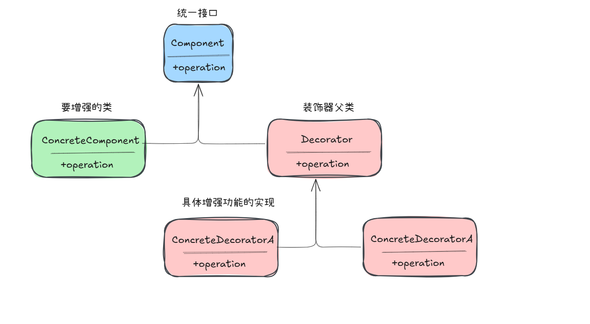

> 动态的给一个对象添加一些额外的职责。

# 小菜靓仔

Pkmer 今天要出门，需要给自己打扮一番。商店里有各种服装配饰：球鞋、垮裤、大T裰、皮鞋、领带、西装等。

Pkmer 不需要从零开始穿衣，而是**在现有装扮的基础上，一件件套上新的衣服**。每件衣服都能"展示"自己，同时把展示的机会留给里面已经穿好的衣服。

## 程序输出

```
---------第一种装扮---------------
球鞋垮裤大T桖装扮的Pkmer
---------第二种装扮---------------
西装领带皮鞋装扮的Pkmer
```

## 模式结构

```
┌─────────────────┐
│   ICharacter    │  ← 接口，定义 show() 方法
└────────┬────────┘
         │
    ┌────┴────┐
    │         │
┌───▼───┐ ┌───▼────────┐
│ Person│ │  Finery    │  ← 装饰器基类
└───────┘ └───┬────────┘
              │
    ┌─────────┼─────────┬─────────┐
    │         │         │         │
┌───▼───┐ ┌───▼──┐ ┌───▼───┐ ┌───▼────┐
│Sneakers│ │BigTrouser│TShirts│ │Suit... │  ← 具体装饰类
└───────┘ └──────┘ └───────┘ └────────┘
```

## 核心思想

1. **组件接口**（`ICharacter`）：定义展示行为
2. **具体组件**（`Person`）：被装饰的对象
3. **装饰器基类**（`Finery`）：持有组件引用，调用被装饰者的展示方法
4. **具体装饰类**（`TShirts`、`Suit` 等）：在展示时，先输出自己的内容，再调用 `super.show()`

这样装扮顺序是**从外到内**输出，但实际穿衣是**从内到外**层层包裹。

## 组件接口

```java
public interface ICharacter {
    void show();
}
```

## 具体组件

```java
public class Person implements ICharacter {
    private String name;

    public Person(String name) {
        this.name = name;
    }

    @Override
    public void show() {
        System.out.println("装扮的" + name);
    }
}
```

## 装饰器基类

```java
public class Finery implements ICharacter {
    private ICharacter component;

    public void decorator(ICharacter component) {
        this.component = component;
    }

    @Override
    public void show() {
        if (component != null) {
            component.show();
        }
    }
}
```

## 具体装饰类

```java
public class TShirts extends Finery {
    @Override
    public void show() {
        System.out.print("大T桖");
        super.show();  // 先输出自己，再调用内部组件
    }
}
```

## 客户端使用

```java
public class Main {
    public static void main(String[] args) {
        Person pkmer = new Person("Pkmer");
        TShirts tShirts = new TShirts();
        BigTrouser bigTrouser = new BigTrouser();
        Sneakers sneakers = new Sneakers();

        // 从内到外层层包装
        tShirts.decorator(pkmer);
        bigTrouser.decorator(tShirts);
        sneakers.decorator(bigTrouser);

        // 输出时从外到内
        sneakers.show();  // 输出：球鞋垮裤大T桖装扮的Pkmer
    }
}
```

## 相关代码

- [Main.java](https://github.com/upangka/ComicJava/blob/main/src/cn/comicjava/ch05/design/decorator/finery/Main.java)
- [ICharacter.java](https://github.com/upangka/ComicJava/blob/main/src/cn/comicjava/ch05/design/decorator/finery/ICharacter.java)
- [Person.java](https://github.com/upangka/ComicJava/blob/main/src/cn/comicjava/ch05/design/decorator/finery/Person.java)
- [Finery.java](https://github.com/upangka/ComicJava/blob/main/src/cn/comicjava/ch05/design/decorator/finery/Finery.java)
- [TShirts.java](https://github.com/upangka/ComicJava/blob/main/src/cn/comicjava/ch05/design/decorator/finery/TShirts.java)
- [BigTrouser.java](https://github.com/upangka/ComicJava/blob/main/src/cn/comicjava/ch05/design/decorator/finery/BigTrouser.java)
- [Sneakers.java](https://github.com/upangka/ComicJava/blob/main/src/cn/comicjava/ch05/design/decorator/finery/Sneakers.java)


## 小结

当扩展其他装扮的时候，只需要新建一个装饰类，实现 `show()` 方法，调用 `super.show()` 即可。


# 商城收银程序

## 场景描述

商场收银系统需要支持多种收费方式：正常收费、打折、满减，以及它们的组合。用户可以选择不同的收费模式，系统自动计算最终的收费金额。

## 程序输出

```
***商品折扣模式如下:***
1.正常收费
2.打八折
3.打七折
4.满300送100
5.先打8折，再满300送100
6.先满200送50，再打7折

请输入商品折扣模式:
6
请输入商品单价：
300
请输入商品数量：
2

单价：300.0元 数量：2 合计：315.0元

总计：315.0元
```

## 模式结构

```
┌─────────────────┐
│     ISale       │  ← 组件接口
└────────┬────────┘
         │
    ┌────┴────┐
    │         │
┌───▼───┐ ┌───▼────────┐
│CashNormal│ │ CashSuper │  ← 装饰器基类
└───────┘ └───┬────────┘
              │
    ┌─────────┼─────────┐
    │         │         │
┌───▼───┐ ┌───▼──┐ ┌───▼───┐
│CashRebate│ │CashReturn│ │...    │  ← 具体装饰类
└───────┘ └──────┘ └───────┘
```

## 核心思想

1. **组件接口**（`ISale`）：定义收费行为 `acceptCash(price, num)`
2. **具体组件**（`CashNormal`）：原价收费
3. **装饰器基类**（`CashSuper`）：持有组件引用，调用被装饰者的收费方法
4. **具体装饰类**（`CashRebate`、`CashReturn` 等）：在收费时，先计算自己的折扣，再调用 `super.acceptCash()`

## 组件接口

```java
public interface ISale {
    double acceptCash(double price, int num);
}
```

## 具体组件

```java
public class CashNormal implements ISale {
    @Override
    public double acceptCash(double price, int num) {
        return price * num;  // 原价收费
    }
}
```

## 装饰器基类

```java
public class CashSuper implements ISale {
    private ISale component;

    public void decorate(ISale component) {
        this.component = component;
    }

    @Override
    public double acceptCash(double price, int num) {
        double result = 0;
        if (component != null) {
            result = component.acceptCash(price, num);  // 调用内部组件计算
        }
        return result;
    }
}
```

## 打折装饰类

```java
public class CashRebate extends CashSuper {
    private double rebate;

    public CashRebate(double rebate) {  // 比如 0.8 表示打8折
        if (rebate < 0 || rebate > 1) {
            throw new IllegalArgumentException("折扣率必须在0-1之间");
        }
        this.rebate = rebate;
    }

    @Override
    public double acceptCash(double price, int num) {
        double result = price * num * rebate;  // 先计算打折后的价格
        return super.acceptCash(result, 1);  // 传递给内部组件
    }
}
```

## 返利装饰类

```java
public class CashReturn extends CashSuper {
    private double moneyCondition = 0.0d;  // 返利条件，如满300
    private double moneyReturn = 0.0d;    // 返利金额，如返100

    public CashReturn(double moneyCondition, double moneyReturn) {
        this.moneyCondition = moneyCondition;
        this.moneyReturn = moneyReturn;
    }

    @Override
    public double acceptCash(double price, int num) {
        double result = price * num;
        if (result >= moneyCondition) {
            result = result - Math.floor(result / moneyCondition) * moneyReturn;
        }
        return super.acceptCash(result, 1);
    }
}
```

## 上下文类

```java
public class CashContext {
    private final ISale cs;

    public CashContext(int cashType) {
        cs = switch (cashType) {
            case 1 -> new CashNormal();  // 正常收费
            case 2 -> new CashRebate(0.8d);  // 打8折
            case 3 -> new CashRebate(0.7d);  // 打7折
            case 4 -> new CashReturn(300d, 100d);  // 满300返100
            case 5 -> {  // 先打8折,再满300返100
                CashNormal cn = new CashNormal();
                CashReturn cashReturn = new CashReturn(300d, 100d);
                CashRebate cashRebate = new CashRebate(0.8d);
                cashReturn.decorate(cn);
                cashRebate.decorate(cashReturn);
                yield cashRebate;
            }
            case 6 -> {  // 先满200返50，再打7折
                CashNormal cashNormal = new CashNormal();
                CashRebate cashRebate = new CashRebate(0.7d);
                CashReturn cashReturn = new CashReturn(200d, 50d);
                cashRebate.decorate(cashNormal);
                cashReturn.decorate(cashRebate);
                yield cashReturn;
            }
            default -> throw new IllegalArgumentException("不支持的现金类型: " + cashType);
        };
    }

    public double getResult(double price, int num) {
        return cs.acceptCash(price, num);
    }
}
```

## 客户端使用

```java
public class Main {
    public static void main(String[] args) {
        try (Scanner sc = new Scanner(System.in)) {
            double total = 0d;
            while (true) {
                // ... 输入逻辑
                CashContext cashContext = new CashContext(type);
                totalPrices = cashContext.getResult(price, num);
                total += totalPrices;
            }
        }
    }
}
```

## 相关代码

- [Main.java](https://github.com/upangka/ComicJava/blob/main/src/cn/comicjava/ch05/design/decorator/shop/Main.java)
- [ISale.java](https://github.com/upangka/ComicJava/blob/main/src/cn/comicjava/ch05/design/decorator/shop/ISale.java)
- [CashSuper.java](https://github.com/upangka/ComicJava/blob/main/src/cn/comicjava/ch05/design/decorator/shop/CashSuper.java)
- [CashNormal.java](https://github.com/upangka/ComicJava/blob/main/src/cn/comicjava/ch05/design/decorator/shop/CashNormal.java)
- [CashRebate.java](https://github.com/upangka/ComicJava/blob/main/src/cn/comicjava/ch05/design/decorator/shop/CashRebate.java)
- [CashReturn.java](https://github.com/upangka/ComicJava/blob/main/src/cn/comicjava/ch05/design/decorator/shop/CashReturn.java)
- [CashContext.java](https://github.com/upangka/ComicJava/blob/main/src/cn/comicjava/ch05/design/decorator/shop/CashContext.java)

## 小结

利用基础CashNormal，CashRebate,CashReturn三种原子算法，通过装饰器各种有选择的，有顺序地组合，形成不同的策略。


# 总结

> **装饰器**
>
> 把每个要装饰的功能，放在单独的类中，并让这些新类包装它所要装饰的对象。客户端使用时，可以根据需要，有选择地、**有顺序**地使用装饰功能包装对象了。

找到基础类，`ConcreteComponent`,也就是要扩充功能的对象。

1. 扩展功能的时候，提供新的类即可
2. 装饰器模式遵循开闭原则，易于扩展和维护
3. 适用于需要动态添加功能的场景