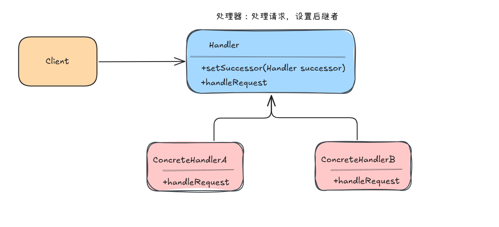

# 介绍

> 使多个对象都有机会处理请求，从而避免请求的发送者和接收者之间的耦合关系。将这个对象连成一条链，并沿着链传递该请求，直到有一个对象处理它为止。

动态的组织和分配职责。

这种链式调用有点像[装饰器模式](./ch05-装饰器模式.md)，不同的点在于，责任链，每个对象都是单独的处理功能，中间的任意一环只要能处理，就不再继续往下传递。



# 数字处理案例

先看一个简单的数字处理案例。有三种处理者，分别处理不同范围的数字：

| 处理者 | 处理范围 |
|--------|----------|
| ConcreteHandlerA | [0, 10) |
| ConcreteHandlerB | [10, 20) |
| ConcreteHandlerC | [20, 30) |

## 抽象处理类

首先定义抽象处理类 [`Handler`](https://github.com/upangka/ComicJava/blob/main/src/cn/comicjava/ch05/design/responsibility/number/Handler.java)，持有后继者引用，并声明抽象处理方法：

```java
public abstract class Handler {
    protected Handler successor;

    public void setSuccessor(Handler successor){
        this.successor = successor;
    }

    public abstract void handleRequest(int request);
}
```

## 具体处理类

每个具体处理者实现 `handleRequest`，判断自己能否处理——能则处理，不能则转交给后继者。

[`ConcreteHandlerA`](https://github.com/upangka/ComicJava/blob/main/src/cn/comicjava/ch05/design/responsibility/number/ConcreteHandlerA.java)：

```java
public class ConcreteHandlerA extends Handler {
    @Override
    public void handleRequest(int request) {
        if (request >= 0 && request < 10) {
            System.out.println("%s[0,10) 处理请求 【%d】".formatted(this.getClass().getSimpleName(), request));
            return;
        }
        if (successor != null) {
            successor.handleRequest(request);
        }
    }
}
```

[`ConcreteHandlerB`](https://github.com/upangka/ComicJava/blob/main/src/cn/comicjava/ch05/design/responsibility/number/ConcreteHandlerB.java) 和 [`ConcreteHandlerC`](https://github.com/upangka/ComicJava/blob/main/src/cn/comicjava/ch05/design/responsibility/number/ConcreteHandlerC.java) 结构相同，只是判断范围不同（[10,20) 和 [20,30)）。

## 构建责任链

在 [`Main`](https://github.com/upangka/ComicJava/blob/main/src/cn/comicjava/ch05/design/responsibility/number/Main.java) 中组装链路：

```java
Handler handlerA = new ConcreteHandlerA();
Handler handlerB = new ConcreteHandlerB();
Handler handlerC = new ConcreteHandlerC();

handlerA.setSuccessor(handlerB);
handlerB.setSuccessor(handlerC);

for (int request : requests) {
    handlerA.handleRequest(request);
}
```

**重点：需要为每个具体的处理者设置后继者**，通过 `setSuccessor` 方法将 A → B → C 串联起来，形成责任链。

## 运行结果

```
ConcreteHandlerB[10,20) 处理请求 【12】
ConcreteHandlerA[0,10) 处理请求 【5】
ConcreteHandlerC[20,30) 处理请求 【28】
ConcreteHandlerB[10,20) 处理请求 【19】
ConcreteHandlerA[0,10) 处理请求 【7】
ConcreteHandlerC[20,30) 处理请求 【24】
ConcreteHandlerA[0,10) 处理请求 【3】
ConcreteHandlerB[10,20) 处理请求 【16】
```

以请求 `12` 为例，流程如下：handlerA 判断不在 [0,10) → 转给 handlerB → handlerB 判断在 [10,20) → 处理并返回。**在每个具体的处理者处理请求时，做出判断，是可以处理这个请求，还是转移给后继者去处理**，这正是责任链的核心逻辑。

*（待续...）*

# 请假与加薪案例

再看一个贴近实际业务的案例：员工提交请假或加薪申请，根据申请类型和数量，由不同级别的管理者审批。

| 管理者 | 职权 |
|--------|------|
| 经理（CommonManager） | 请假 ≤ 2 天 |
| 总监（Director） | 请假 ≤ 5 天 |
| 总经理（GeneralManager） | 请假任意天数；加薪 ≤ 5000 批准，> 5000 拒绝 |

## 请求对象

使用 Java record 定义请求 [`Request`](https://github.com/upangka/ComicJava/blob/main/src/cn/comicjava/ch05/design/responsibility/manager/Request.java)，封装申请类别、内容和数量：

```java
public record Request(
        String type,    // 申请类别：请假 / 加薪
        String content, // 申请内容
        Integer number  // 数量：天数 / 金额
) {}
```

## 抽象管理者

[`Manager`](https://github.com/upangka/ComicJava/blob/main/src/cn/comicjava/ch05/design/responsibility/manager/Manager.java) 持有上级引用，声明抽象审批方法：

```java
public abstract class Manager {
    protected String name;
    protected Manager superior; // 上级

    public Manager(String name){
        this.name = name;
    }

    public void setSuperior(Manager superior){
        this.superior = superior;
    }

    public abstract void requestApplication(Request request);
}
```

与数字处理案例不同，这里后继者叫 `superior`（上级），语义更贴合组织架构——自己处理不了就往上报。

## 具体管理者

[`CommonManager`](https://github.com/upangka/ComicJava/blob/main/src/cn/comicjava/ch05/design/responsibility/manager/CommonManager.java)（经理）只能批 2 天以内的请假：

```java
public class CommonManager extends Manager {
    @Override
    public void requestApplication(Request request) {
        if ("请假".equals(request.type()) && request.number() <= 2)
            System.out.println(this.name + ":" + request.content() + " 数量：" + request.number() + "天，被批准");
        else {
            if (this.superior != null)
                this.superior.requestApplication(request);
        }
    }
}
```

[`Director`](https://github.com/upangka/ComicJava/blob/main/src/cn/comicjava/ch05/design/responsibility/manager/Director.java)（总监）能批 5 天以内的请假，超出则上报：

```java
public class Director extends Manager {
    @Override
    public void requestApplication(Request request) {
        if ("请假".equals(request.type()) && request.number() <= 5)
            System.out.println(this.name + ":" + request.content() + " 数量：" + request.number() + "天，被批准");
        else {
            if (this.superior != null)
                this.superior.requestApplication(request);
        }
    }
}
```

[`GeneralManager`](https://github.com/upangka/ComicJava/blob/main/src/cn/comicjava/ch05/design/responsibility/manager/GeneralManager.java)（总经理）是链的末端，请假一律批准，加薪视金额决定：

```java
public class GeneralManager extends Manager {
    @Override
    public void requestApplication(Request request) {
        if ("请假".equals(request.type())) {
            System.out.println(this.name + ":" + request.content() + " 数量：" + request.number() + "天，被批准");
        } else if ("加薪".equals(request.type()) && request.number() <= 5000) {
            System.out.println(this.name + ":" + request.content() + " 数量：" + request.number() + "元，被批准");
        } else if ("加薪".equals(request.type()) && request.number() > 5000) {
            System.out.println(this.name + ":" + request.content() + " 数量：" + request.number() + "元，再说吧");
        }
    }
}
```

注意总经理没有上级，不会再往上报，而是直接给出最终结果（批准或拒绝）。

## 构建责任链

在 [`Main`](https://github.com/upangka/ComicJava/blob/main/src/cn/comicjava/ch05/design/responsibility/manager/Main.java) 中组装管理层级：

```java
CommonManager manager = new CommonManager("经理");
Director director = new Director("总监");
GeneralManager generalManager = new GeneralManager("总经理");

manager.setSuperior(director);
director.setSuperior(generalManager);
```

经理 → 总监 → 总经理，逐级上报。

## 运行结果

```
**********************************************
经理:小菜请假 数量：1天，被批准
总监:小菜请假 数量：3天，被批准
总经理:小菜请求加薪 数量：5000元，被批准
总经理:小菜请求加薪 数量：10000元，再说吧

**********************************************
```

以"请假 3 天"为例：经理判断超出 2 天 → 上报总监 → 总监判断在 5 天以内 → 批准。而"加薪 10000 元"一路上报到总经理，因超出 5000 被拒绝。

这个案例相比数字处理，更体现了责任链在实际业务中的价值：**请求者只需提交给链头，无需关心最终由谁审批；每个管理者只关注自己权限范围内的请求，超出则上报**。发送者和接收者完全解耦。

*（待续...）*

