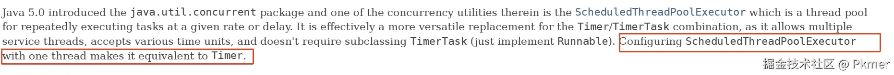
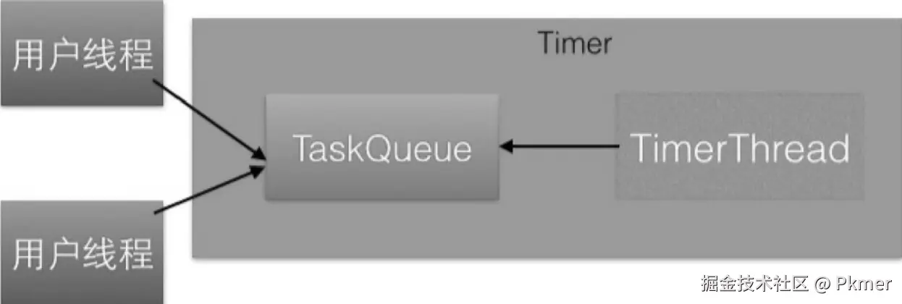
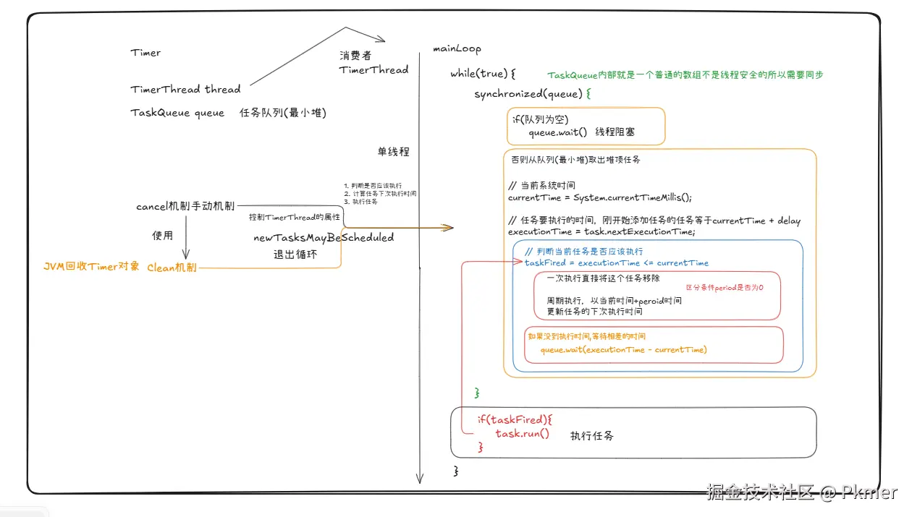
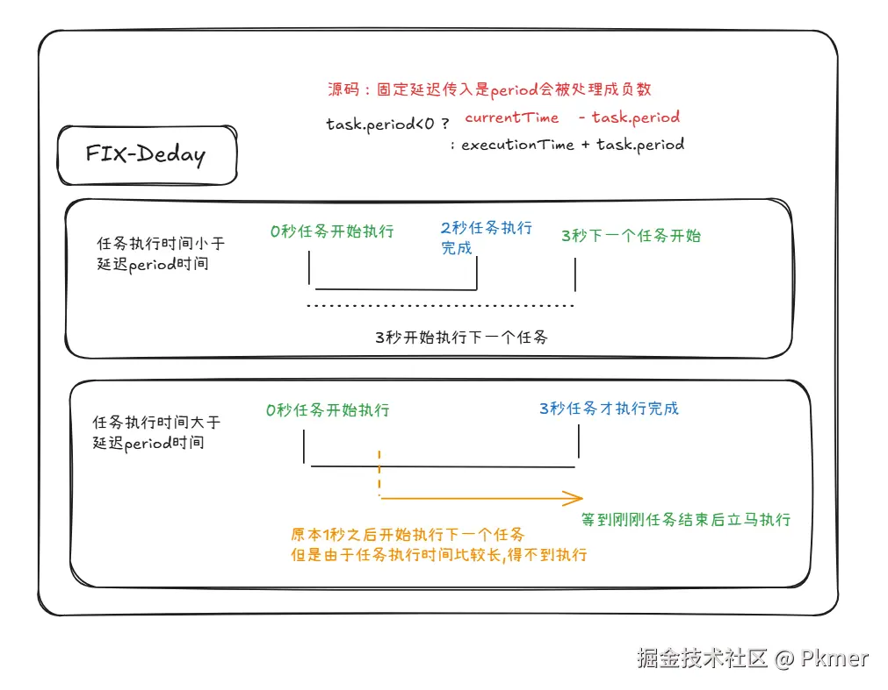
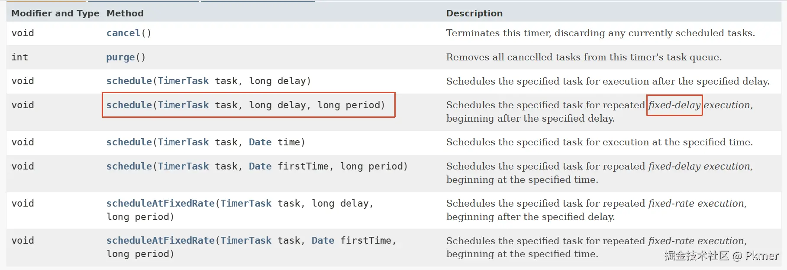
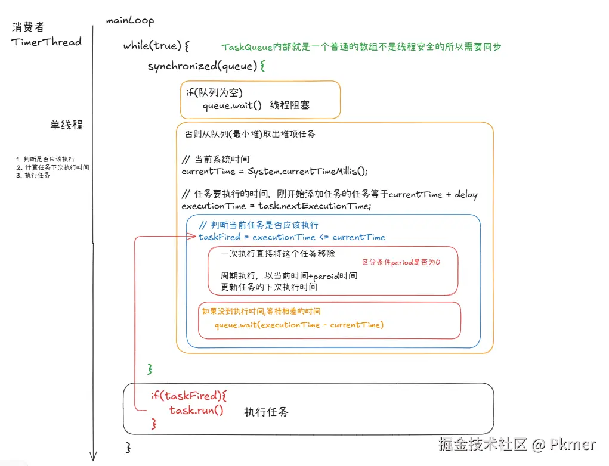
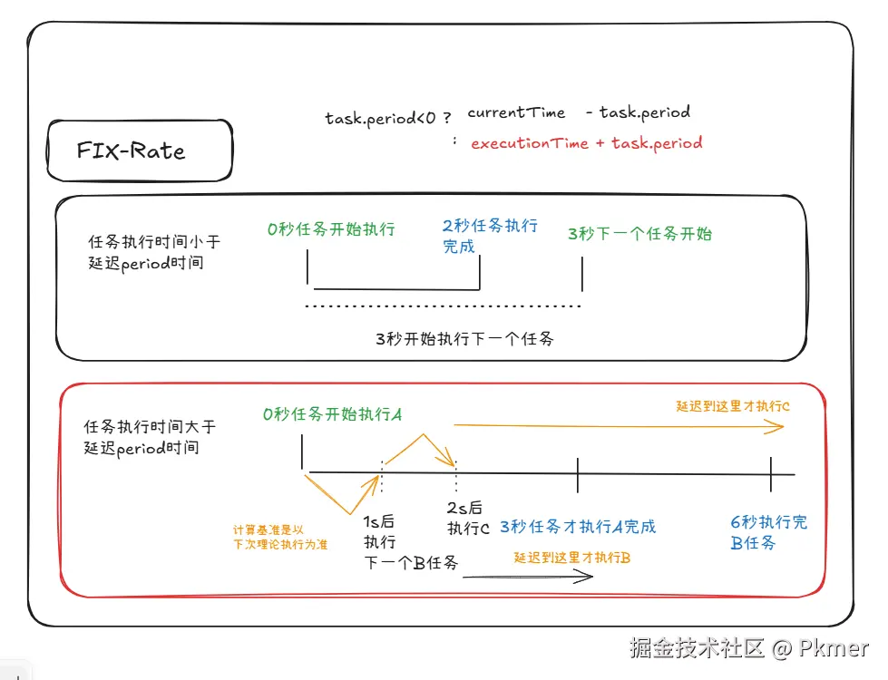
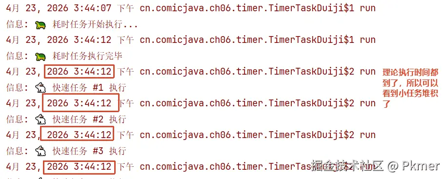
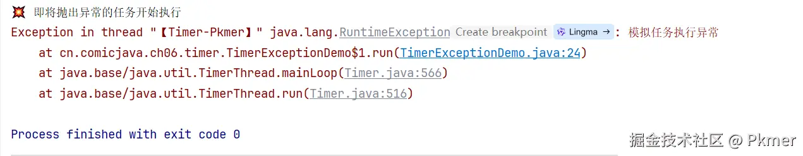

> 熟悉传统的Timer，它的优点以及却缺点，方便掌握现代化的`ScheduledThreadPoolExecutor`

[JDK17-Timer的文档](https://docs.oracle.com/en/java/javase/17/docs/api/java.base/java/util/Timer.html)
提到将`ScheduledThreadPool`配置为一个线程能够到达Timer同样的效果。




# 目标掌握

1. Timer的基本使用（理解他的多生产与单消费的设计）
2. 区分fixed-delay与fixed-rate的区别
3. Timer的缺点

# Timer

一个非常典型的多生产者，单一消费的案例。




> 整体架构




# 基础使用

在延迟1秒后执行，且只执行一次

[`TimerBaseUsage`](https://github.com/upangka/ComicJava/blob/main/src/cn/comicjava/ch06/timer/TimerBaseUsage.java)

```java
public class TimerBaseUsage {
    private static final Logger LOGGER = Logger.getLogger(TimerBaseUsage.class.getName());
    public static void main(String[] args) {
        Timer timer = new Timer("【Pkmer-timer】");
        LOGGER.info("启动定时器");
        timer.schedule(new TimerTask() {
            @Override
            public void run() {
               LOGGER.info("执行任务中");
            }
        },1000);
    }
}
```

可以很明显看到,在`2026 12:16:38`启动，在`2026 12:16:39`延迟了1秒启动。

```python
4月 23, 2026 12:16:38 下午 cn.comicjava.ch06.timer.TimerBaseUsage main
信息: 启动定时器
4月 23, 2026 12:16:39 下午 cn.comicjava.ch06.timer.TimerBaseUsage$1 run
信息: 执行任务中
```

## fixed-delay

> `fixed-delay`(固定延迟): 以**任务实际开始执行的时间**为基准计算下次执行 
> 
> **下一次执行时间 = 当前任务开始执行时间+peroid**






距离上次开始时间，经过`period`多久后,继续执行。无限多次。

### 任务执行时间小于peroid延迟时间

[`TimerFixDedayUsageV2`](https://github.com/upangka/ComicJava/blob/main/src/cn/comicjava/ch06/timer/TimerFixDedayUsageV2.java)

```java
public class TimerFixDedayUsageV2 {
    private static final Logger LOGGER = Logger.getLogger(TimerFixDedayUsageV2.class.getName());
    public static void main(String[] args) {
        Timer timer = new Timer("【Pkmer-timer】");
        LOGGER.info("启动定时器");
        timer.schedule(new TimerTask() {
            @Override
            public void run() {
                LOGGER.info("开始执行任务");
                try {
                    Thread.sleep(2000L);
                } catch (InterruptedException e) {
                }
                LOGGER.info("执行任务结束");
            }
        },0,3000); // 0不延迟，立即执行。3000 之后执行后执行
    }
}
```
每次间隔3秒执行,可以看到任务执行了2秒，延迟peroid是3秒。是以任务开始的时间为基准来计算下一次执行的时间。

```python
4月 23, 2026 1:31:35 下午 cn.comicjava.ch06.timer.TimerFixDedayUsageV2$1 run
信息: 开始执行任务
4月 23, 2026 1:31:37 下午 cn.comicjava.ch06.timer.TimerFixDedayUsageV2$1 run
信息: 执行任务结束
4月 23, 2026 1:31:38 下午 cn.comicjava.ch06.timer.TimerFixDedayUsageV2$1 run
信息: 开始执行任务
4月 23, 2026 1:31:40 下午 cn.comicjava.ch06.timer.TimerFixDedayUsageV2$1 run
信息: 执行任务结束
4月 23, 2026 1:31:41 下午 cn.comicjava.ch06.timer.TimerFixDedayUsageV2$1 run
信息: 开始执行任务
```

### 任务执行时间大于peroid延迟时间

现在任务执行时间为

[`TimerFixDedayUsageV3`](https://github.com/upangka/ComicJava/blob/main/src/cn/comicjava/ch06/timer/TimerFixDedayUsageV3.java)

```java
public class TimerFixDedayUsageV3 {
    private static final Logger LOGGER = Logger.getLogger(TimerFixDedayUsageV3.class.getName());
    public static void main(String[] args) {
        Timer timer = new Timer("【Pkmer-timer】");
        LOGGER.info("启动定时器");
        timer.schedule(new TimerTask() {
            @Override
            public void run() {
                LOGGER.info("开始执行任务");
                try {
                    Thread.sleep(3000L);
                } catch (InterruptedException e) {
                }
                LOGGER.info("执行任务结束");
            }
        },0,1000); // 0不延迟，立即执行。1000 之后每次执行开始后，延迟1s，后执行
    }
}
```

任务执行完成后，立即执行下一个任务

```python
4月 23, 2026 1:45:58 下午 cn.comicjava.ch06.timer.TimerFixDedayUsageV3$1 run
信息: 开始执行任务
4月 23, 2026 1:46:01 下午 cn.comicjava.ch06.timer.TimerFixDedayUsageV3$1 run
信息: 执行任务结束
4月 23, 2026 1:46:01 下午 cn.comicjava.ch06.timer.TimerFixDedayUsageV3$1 run
信息: 开始执行任务
4月 23, 2026 1:46:04 下午 cn.comicjava.ch06.timer.TimerFixDedayUsageV3$1 run
信息: 执行任务结束
4月 23, 2026 1:46:04 下午 cn.comicjava.ch06.timer.TimerFixDedayUsageV3$1 run
信息: 开始执行任务
```

### 🌅从源码角度理解

消费者也就是处理任务是**单线处理**，

这个单线程一直在一个while循环中，从一个任务队列中获取要执行的任务，如果队列为空这用jvm的监视器进行wait，否则从队列中取出任务（队列是一个最小堆，每次取出最小值），判断任务要执行的时间与当前时间，如果到了要执行了，创建一个新任务，并把新任务的下次执行的时间计算好，就是currentTime + period（源码中是currentTime - period是因为通过通过peroid的符号来区分是fix-delay还是fix-rate.fix-delay会把peroid处理成负数）



```java
private void mainLoop() {
    while (true) {
        try {
            TimerTask task;
            boolean taskFired;
            synchronized(queue) {
                // Wait for queue to become non-empty
                while (queue.isEmpty() && newTasksMayBeScheduled)
                    queue.wait();
                if (queue.isEmpty())
                    break; // Queue is empty and will forever remain; die

                // Queue nonempty; look at first evt and do the right thing
                long currentTime, executionTime;
                task = queue.getMin();
                synchronized(task.lock) {
                    if (task.state == TimerTask.CANCELLED) {
                        queue.removeMin();
                        continue;  // No action required, poll queue again
                    }
                    currentTime = System.currentTimeMillis();
                    executionTime = task.nextExecutionTime;
                    if (taskFired = (executionTime<=currentTime)) {
                        if (task.period == 0) { // Non-repeating, remove
                            queue.removeMin();
                            task.state = TimerTask.EXECUTED;
                        } else { // Repeating task, reschedule
                            queue.rescheduleMin(
                              task.period<0 ? currentTime   - task.period
                                            : executionTime + task.period);
                        }
                    }
                }
                if (!taskFired) // Task hasn't yet fired; wait
                    queue.wait(executionTime - currentTime);
            }
            if (taskFired)  // Task fired; run it, holding no locks
                task.run();
        } catch(InterruptedException e) {
        }
    }
}
```

## fixed-rate

`fixed-rate`(固定频率)：以**上次任务理论上开始执行的时间**为基准计算下次执行。会有**任务堆积**的现象产生




> 这里以任务运行时间超过peroid延迟时间来说明。

[`TimerFixRateV2`](https://github.com/upangka/ComicJava/blob/main/src/cn/comicjava/ch06/timer/TimerFixRateV2.java)

```java
public class TimerFixRateV2 {
    private static final Logger LOGGER = Logger.getLogger(TimerFixRateV2.class.getName());
    public static void main(String[] args) {
        Timer timer = new Timer("【Pkmer-timer】");
        LOGGER.info("启动定时器");
        timer.scheduleAtFixedRate(new TimerTask() {
            @Override
            public void run() {
                LOGGER.info("开始执行任务");
                try {
                    Thread.sleep(3000L);
                } catch (InterruptedException e) {
                }
                LOGGER.info("执行任务结束");
            }
        },0,1000);
    }
}
```

```python
4月 23, 2026 2:45:46 下午 cn.comicjava.ch06.timer.TimerFixRateV2$1 run
信息: 开始执行任务
4月 23, 2026 2:45:49 下午 cn.comicjava.ch06.timer.TimerFixRateV2$1 run
信息: 执行任务结束
4月 23, 2026 2:45:49 下午 cn.comicjava.ch06.timer.TimerFixRateV2$1 run
信息: 开始执行任务
4月 23, 2026 2:45:52 下午 cn.comicjava.ch06.timer.TimerFixRateV2$1 run
信息: 执行任务结束
4月 23, 2026 2:45:52 下午 cn.comicjava.ch06.timer.TimerFixRateV2$1 run
信息: 开始执行任务
4月 23, 2026 2:45:55 下午 cn.comicjava.ch06.timer.TimerFixRateV2$1 run
信息: 执行任务结束
4月 23, 2026 2:45:55 下午 cn.comicjava.ch06.timer.TimerFixRateV2$1 run
信息: 开始执行任务
```

## 小结

`Timeer`中的`TimerThread`的源码足以说明`fixed-rate`与`fixed-delay`的区别

```
currentTime = System.currentTimeMillis();
executionTime = task.nextExecutionTime;

task.nextExecutionTime = task.period<0 ? currentTime - task.period
                  : executionTime + task.period
```


# 停止

主要是停止TimerThread这个线程，因为它是在一个f循环中运行的。**本质上还是通过变量的可见性方式退出循环**

1. 通过手动调用`Timer.cancel`方法停止
2. `Timer`没有任何强引用的时候被JVM回收，也要停止`TimerThread`线程。通过Clean

> 底层源码:

 1. 主要是通过设置`newTasksMayBeScheduled`为`false`

```java
this.cleanup = CleanerFactory.cleaner().register(this, threadReaper);

public void cancel() {
    synchronized(queue) {
        queue.clear();
        cleanup.clean();
    }
}

private static class ThreadReaper implements Runnable {
    private final TaskQueue queue;
    private final TimerThread thread;

    ThreadReaper(TaskQueue queue, TimerThread thread) {
        this.queue = queue;
        this.thread = thread;
    }

    public void run() {
        synchronized(queue) {
            thread.newTasksMayBeScheduled = false;
            queue.notify(); // In case queue is empty.
        }
    }
}
```

2. 变量`newTasksMayBeScheduled`为false后TimerThread退出循环。说明JVM自动清理的时候，会等队列里面的任务全部处理完成。

```java
while (queue.isEmpty() && newTasksMayBeScheduled)  // 不会等待
    queue.wait();
if (queue.isEmpty())  // 队列为空，退出
    break; // Queue is empty and will forever remain; die
```

# 缺点


## 霸占线程导致任务堆积

在上面的`fixed-rate`中我们知道，以固定速率执行一个任务（它的理论执行时间是以任务上次理论执行时间计算的）。由于消费者TimerThread是一个单线程。如果前面有大任务，或者自身任务执行过长，但是peroid又短。很容易造成任务堆积。



[`TimerTaskDuiji`](https://github.com/upangka/ComicJava/blob/main/src/cn/comicjava/ch06/timer/TimerTaskDuiji.java)

```java
public class TimerTaskDuiji {

    private static final Logger log = Logger.getLogger(TimerTaskDuiji.class.getName());
    public static void main(String[] args) {
        Timer timer = new Timer();

        // 安排一个耗时任务（模拟处理大量数据）
        timer.schedule(new TimerTask() {
            @Override
            public void run() {
                log.info("🐢 耗时任务开始执行...");
                try {
                    Thread.sleep(5000); // 模拟耗时5秒的操作
                } catch (InterruptedException e) {
                    Thread.currentThread().interrupt();
                }
                log.info("🐢 耗时任务执行完毕");
            }
        }, 0); // 立即执行

        // 安排一个快速任务，预期每1秒执行一次
        timer.scheduleAtFixedRate(new TimerTask() {
            private int count = 0;

            @Override
            public void run() {
                count++;
                log.info("🐇 快速任务 #" + count + " 执行");
            }
        }, 0, 1000);

        // 程序运行8秒后退出
        try {
            Thread.sleep(8000);
        } catch (InterruptedException e) {
            Thread.currentThread().interrupt();
        }

        timer.cancel();
    }
}
```

## 任务异常导致整个 Timer 崩溃

从源码知道，`TimerTask`在一个while中不断循环，当任务代码抛出异常之后，它并没有catch住，导致退出循环线程结束。

```java
while (true) {
    try{
        // ... ...
        if (taskFired)  
            task.run();
    } catch(InterruptedException e) { // 只抓了中断
    }
}
```

> 案例

[`TimerExceptionDemo`](https://github.com/upangka/ComicJava/blob/main/src/cn/comicjava/ch06/timer/TimerExceptionDemo.java)

```java
public class TimerExceptionDemo {
    public static void main(String[] args) {
        Timer timer = new Timer("【Timer-Pkmer】");
        // 任务1：会抛出异常
        timer.schedule(new TimerTask() {
            @Override
            public void run() {
                System.out.println("💥 即将抛出异常的任务开始执行");
                throw new RuntimeException("模拟任务执行异常");
            }
        }, 0);

        // 任务2：正常任务
        timer.schedule(new TimerTask() {
            @Override
            public void run() {
                System.out.println("✅ 我是正常任务，但我永远没机会执行了");
            }
        }, 2000);
    }
}
```


